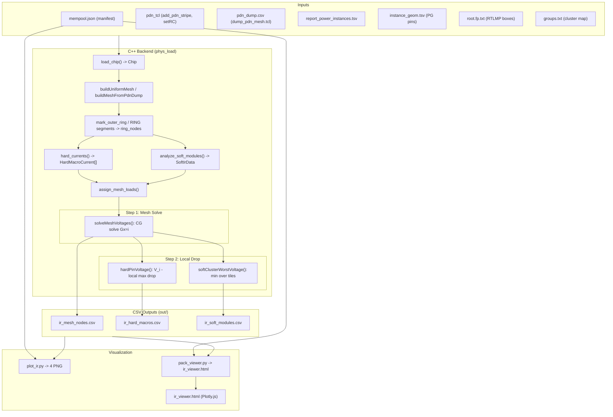

# IR Drop 計算 / 圖片生成 / GUI 實作細節總覽

## 系統架構一覽



---

## 一、IR Drop 計算（C++ 後端）

### 相關檔案
- [`research/include/phys/pdn_ir.hpp`](research/include/phys/pdn_ir.hpp) — 資料結構與 IrModel 介面
- [`research/src/pdn_ir.cpp`](research/src/pdn_ir.cpp) — 所有計算邏輯
- [`research/src/main.cpp`](research/src/main.cpp) — 組裝流程、CSV 輸出

---

### 1.1 Mesh 建構

**關鍵資料結構**：`MeshNode`、`UniformMesh`

```
MeshNode { ix, iy, x_um, y_um, v_V, I_soft_A, I_hard_A, is_ring, v_src_V }
UniformMesh { nx, ny, pitch_x_um, pitch_y_um, nodes[], ring_nodes[] }
```

**兩種模式**：

| 模式 | 函式 | Node 座標來源 |
|------|------|--------------|
| `--mesh synth` | `buildUniformMesh(pitch_x, pitch_y)` | 從 `add_pdn_stripe` 最小 pitch 推算，在 `layout.core` 上均勻格點 |
| `--mesh odb` | `buildMeshFromPdnDump(dump, rc_r_per_um, v_supply)` | 從 PDN dump 的 STRIPE 中心座標交叉，產生非均勻格點 |

兩種模式都會在最後呼叫 ring 標記。

---

### 1.2 Ring Nodes（Voltage Source 邊界條件）

**Paper**："all voltage sources are assigned to the nodes on the ring"

- **synth 模式**：`mark_outer_ring()` 將 `ix==0`、`ix==nx-1`、`iy==0`、`iy==ny-1` 的節點標記為 `is_ring=true`，`v_src_V = VDD`
- **odb 模式**：找出被 PDN dump 中 `kind=="RING"` segment 覆蓋的 mesh nodes 標記為 ring（有 0.5 um slack）；若 dump 無 RING segment，fallback 到 synth 的 `mark_outer_ring()`

---

### 1.3 Sheet Resistance 模型

**`StrapSheetModel`**：`{ r_sqh, r_sqv, w_hstrap_um, w_vstrap_um }`

推算方式（synth 模式，由 `derive_mesh_ir_from_openroad()` 執行）：
- 從 `add_pdn_stripe` 中選出最小 pitch 的兩個 layer（一水平、一垂直）
- `r_sqh = r_per_um(layer_h) * w_h`
- `r_sqv = r_per_um(layer_v) * w_v`

等效電阻公式：`R_h = r_sqh * dx / w_h = r_per_um * dx`，即 wire 長度 dx 的總電阻，與 paper 相符。

---

### 1.4 兩步驟 IR Drop 計算（`--ir-mode max`，預設）

IR drop 計算分為兩個步驟，對應 paper 的公式：

#### Step 1：Mesh Solve（`solveMeshVoltages()` / `solve_mesh_cg()`）

建立 conductance matrix **G**，以 Jacobi-preconditioned CG 求解 **Gx = i**，得到每個 mesh node 上的電壓 V_i。

**Conductance matrix 建構**（5-point stencil，`matvec_G()`）：
- 水平相鄰節點 (ix, iy) <-> (ix+1, iy)：`g_h = w_hstrap / (r_sqh * dx)`
- 垂直相鄰節點 (ix, iy) <-> (ix, iy+1)：`g_v = w_vstrap / (r_sqv * dy)`
- 對角線 `G[i,i]` = 所有鄰居 conductance 之和
- 離對角線 `G[i,j]` = `-g` （若 i, j 相鄰）
- 支援均勻（synth）與非均勻（odb）mesh：間距 dx/dy 直接從節點座標差計算

**邊界條件**（ring nodes）：
- Ring 節點的 row 設為 identity：`G[ring, ring] = 1`，其餘為 0
- RHS 向量：`b[ring] = v_src_V`（= VDD）
- 內部節點：`b[n] = -(I_soft_A + I_hard_A)`（電流消耗，符號為負）

**Solver**（`solve_mesh_cg()`）：
- Jacobi 預處理器（`diag_G()`）：`M^{-1}[i] = 1 / G[i,i]`
- CG 收斂條件：`||r||_2 < tol`（預設 tol = 1e-10）
- 最大迭代次數：5000（典型 mesh 數百節點，數十次即收斂）
- 初始猜測：所有節點設為 VDD（mesh 建構時的初始值）
- 結果寫入 `mesh.nodes[*].v_V`

#### Step 2：Local Drop（hard macro / soft module）

使用 Step 1 求解的 V_i 為基準，再計算從 mesh node 到實際負載位置的局部 IR drop。局部 drop 一律使用 **max(Rh, Rv)**。

**Hard macro P/G pin**（`hard_pin_V()`）：

對 pin j 找到最近 mesh node i，計算：

```
V_j = V_i - I_j * max(r_sqh * Dx_ij / w_hstrap, r_sqv * Dy_ij / w_vstrap)
```

- `V_i`：Step 1 CG 求解的 mesh node 電壓（`mesh.nodes[i].v_V`）
- `Dx_ij = |pin_x - node_i.x|`，`Dy_ij = |pin_y - node_i.y|`
- `I_j`：該 pin 分配到的電流

**Soft module worst-case**（`soft_tile_worst_V()`）：

對所有與 cluster box 重疊的 tile i，計算：

```
V_k = min over S_ov { V_i - I_{k,i} * max(r_sqh * Dx_ik / w_hstrap, r_sqv * Dy_ik / w_vstrap) }
```

- `V_i`：Step 1 CG 求解的 mesh node 電壓
- `I_{k,i} = kn.imax(A_ov)`：module k 在 tile i 的 knapsack 電流
- `Dx_ik`、`Dy_ik`：mesh node i 到 overlap 區域最遠角的距離（worst case）
  - `Dx = max(|ox1 - node.x|, |ox0 - node.x|)`
  - `Dy = max(|oy1 - node.y|, |oy0 - node.y|)`
- 取所有重疊 tile 中的最小 V 作為該 cluster 的最差電壓

**`local_max_drop()` 輔助函式**：

```
drop = I * max(r_sqh * dx / w_hstrap, r_sqv * dy / w_vstrap)
```

此函式被 `hard_pin_V()` 和 `soft_tile_worst_V()` 共用。

---

### 1.5 Legacy 模式（`--ir-mode sum`）

保留舊的 lumped 計算路徑供對照。此模式不執行 CG mesh solve，直接以
`V = V_ring - I * (Rh + Rv)` 計算每個 node/pin/tile 的電壓（Manhattan
路徑至最近 ring node）。

**`node_voltage_under_load()`**（僅 sum 模式使用）：
1. 找到 load node 的最近 ring node（Manhattan distance）
2. 計算 `dx = |load.x - ring.x|`，`dy = |load.y - ring.y|`
3. 返回 `ring.v_src_V - I * (r_sqh*dx/w_h + r_sqv*dy/w_v)`

**`updateMeshVoltages()`** 依 `ir_mode` 分流：
- `Max`：呼叫 `solveMeshVoltages()`（CG solve）
- `Sum`：逐節點呼叫 `nodeVoltage()` → `node_voltage_under_load()`

---

### 1.6 Hard Macro PG Pin 電流

**`hard_currents()`**：
- 只處理 `fp_is_hard()` 為 true 的 FpBox（所有 token 均為 macro）
- 每個 macro instance：`I_each = inst_I(inst) / n_pg_pins`（電流平均分配到所有 PG pins）
- 輸出：`HardMacroCurrent { instance, fp_region, pg_pin_name, current_A, pin_x_um, pin_y_um }`

**電壓估算**（`hard_pin_V()`）：
1. `nearest_node_manhattan(pin_x, pin_y, mesh)` 找最近 mesh node i
2. **Max 模式**（paper）：`V_j = mesh.nodes[i].v_V - local_max_drop(strap, dx, dy, I_j)`
3. **Sum 模式**（legacy）：`node_voltage_under_load(mesh, strap, i, I_j, Sum)`

---

### 1.7 Soft Module 分數背包（Fractional Knapsack）

**`analyze_soft_modules()`**：
- 以 `cluster_id` 聚合所有 standard cell instance 的電流
- 每個 instance 產生一個 item `(I, area)`，按 `I/area` 降序排列
- 建立 `SoftKnapsackProfile { I_[], A_[], cumA_[], cumI_[] }`

**`imax(W)`**：
- 二元搜尋 `cumA_` 找到容量 W 下可完整放入的最後一個 item
- 末尾 item 取分數：`out += (W - cumA_[full]) / A_[full] * I_[full]`

---

### 1.8 Mesh Load 分配（`assign_mesh_loads()`）

**Soft module 分配**：
- 對每個 mesh tile（由 `node_tile_um()` 計算 tile 邊界：相鄰節點中線，邊緣節點延伸至 core 邊界）
- 計算 tile 與 cluster bounding box 的 `A_ov = rect_overlap_um2()`
- `node.I_soft_A += kn.imax(A_ov)`
- 同步累計 `m.i_mesh_sum_A`

**Hard macro 分配**：
- 每個 pin 找 `nearest_node_manhattan()` -> `node.I_hard_A += pin.current_A`

---

### 1.9 Soft Cluster 最差電壓（`soft_tile_worst_V()`）

- 對所有與 cluster box 重疊的 tile：
  - **Max 模式**（paper）：讀取 CG 求解的 `V_i`，計算到 overlap 最遠角的 `local_max_drop`，`v = V_i - drop`
  - **Sum 模式**（legacy）：呼叫 `node_voltage_under_load(idx, kn.imax(A_ov))`
- 取 `vmin = min(v)` 作為該 cluster 的最差估計電壓

---

### 1.10 電流來源優先順序（`inst_I()`）

```
1. STA current (report_power_instances.tsv 的 current_A 欄位，若 has_current 為 true)
2. STA total_W / VDD
3. manual_power_W / VDD (manifest 的 pwr 區塊)
4. 0 (無資料)
```

VDD 從所有 instance 的 `total_W / current_A` 中位數推算。

---

### 1.11 IrMode 列舉

```
enum class IrMode { Sum, Max };
```

| 模式 | 預設 | Step 1 | Step 2 (local drop) | 備註 |
|------|------|--------|---------------------|------|
| `Max` | 是（`--ir-mode max`） | CG solve Gx=i | `I * max(Rh, Rv)` | paper 公式 |
| `Sum` | 否（`--ir-mode sum`） | 無（lumped） | `I * (Rh + Rv)` 到最近 ring | legacy 對照 |

---

### 1.12 CSV 輸出格式

**`ir_mesh_nodes.csv`**：
```
layer  ix  iy  x_um  y_um  i_soft_A  i_hard_A  i_total_A  v_V  is_vsrc
```
- `layer`：multi-layer mesh 的金屬層名稱（如 `metal1`、`metal4`、`metal7`），單層 mesh 為空
- `is_vsrc`：1 表示該節點為 voltage source（BTERM/Ring），0 表示一般節點

**`ir_hard_macros.csv`**：
```
instance  fp_region  pg_pin_name  pin_x_um  pin_y_um  imax_A  vpin_est_V
```

**`ir_soft_modules.csv`**：
```
cluster_id  cluster_name  instance_count  i_observed_A  i_worst_box_A  i_mesh_sum_A  vmin_tile_V
```

**`ir_via_connections.csv`**（multi-layer mesh only）：
```
node_a  layer_a  x_a_um  y_a_um  node_b  layer_b  x_b_um  y_b_um  g_siemens
```
- 記錄所有跨層 via 連接（adjacency list 中 layer 不同的 edge），每條 edge 只出現一次

**`ir_pdn_stripes.csv`**（odb/multilayer mode only）：
```
kind  layer  xlo_um  ylo_um  xhi_um  yhi_um
```
- PDN dump segments 的副本（STRIPE、RING、FOLLOWPIN、BTERM），置於 output 目錄方便視覺化

---

## 二、靜態圖片生成（plot_ir.py）

**相關檔案**：[`research/scripts/plot_ir.py`](research/scripts/plot_ir.py)

### 輸入
- 五份 CSV（`out/ir_*.csv`）+ manifest（core/die bbox、design name、`rtl_fp` 路徑）
- `ir_via_connections.csv` 與 `ir_pdn_stripes.csv` 為可選輸入（不存在時自動略過）

### `mesh_grid(mesh, col)`
- 將 CSV 的 flat rows 重組成 `(ny, nx)` 的 numpy 2D array（`Z`）
- 同時提取 `xs[nx]`、`ys[ny]` 座標陣列

### Overlay 輔助函式

- `overlay_vsrc(ax, mesh)`：讀取 `is_vsrc` 欄位，將 voltage source 節點以紅色菱形標記（`marker="D"`，紅色 `#e03030`）繪製在圖上
- `overlay_vias(ax, via_df, layer)`：讀取 `ir_via_connections.csv`，將 via 連接位置以紫色「x」標記繪製；可指定 layer 過濾

### 五張輸出圖

| 輸出檔 | 顯示內容 | Colormap | 特殊處理 |
|--------|----------|----------|----------|
| `ir_mesh_voltage.png` | mesh node 電壓 (V) | `turbo_r`（reversed，低電壓為熱色） | title 顯示 V_min/V_max/drop_max；疊加 voltage source 紅色菱形與 via 紫色叉號 |
| `ir_mesh_current.png` | mesh 總電流 (A) | `magma` | title 顯示 I_max；疊加 voltage source 與 via 標記 |
| `ir_hard_pins.png` | 電壓底圖（alpha=0.45）+ hard PG pin scatter | `turbo_r` | marker size ∝ `imax_A/max`（20~140 pts），color = `vpin_est_V` |
| `ir_soft_clusters.png` | 電壓底圖（alpha=0.35）+ soft cluster rectangles | `turbo_r` | facecolor 由 `vmin_tile_V` 映射；無 fp bbox 的 cluster 略過 |
| `ir_layer_drops.png` | 每層 IR drop (mV) 子圖 | `hot` | 各層 subplot（M1/M4/M7 等），共用色條；疊加 voltage source 與 via 標記 |

所有圖均由 `draw_frame()` 繪製 core（黑實線）與 die（灰虛線）邊框，`aspect="equal"`。

---

## 三、互動 GUI

### 3.1 2D 互動 GUI（ir_viewer.html）

**相關檔案**：
- [`research/scripts/pack_viewer.py`](research/scripts/pack_viewer.py) — 資料封裝腳本
- [`research/viewer/ir_viewer.html.tmpl`](research/viewer/ir_viewer.html.tmpl) — 2D HTML 模板
- [`research/out/ir_viewer.html`](research/out/ir_viewer.html) — 生成的自含式 HTML

### pack_viewer.py 的打包流程

1. 讀入五份 CSV 與 manifest
2. `mesh_to_arrays()` 將 CSV 轉成 `{ nx, ny, x[], y[], v[][], i_total[][], i_hard[][], i_soft[][] }` 的 2D 陣列結構
3. 從 manifest 的 `rtl_fp` 路徑讀 `root.fp.txt`，取得各 cluster 的 `(lx, ly, ux, uy)` bounding box（DBU → um 換算）
4. 額外讀取 `ir_via_connections.csv`、`ir_pdn_stripes.csv`，提取 voltage source 節點（`is_vsrc==1`），組裝 `layer_z_map`
5. `build_payload()` 組合成 JSON payload（NaN/Inf → null），包含 `vsrc_nodes`、`via_connections`、`pdn_stripes`、`layer_z_map`
6. `write_html()` 將 payload 替換模板中的 `/*__IR_DATA_JSON__*/ null` token
7. `--mode` 參數控制生成 `2d`、`3d`、或 `both`（預設 `both`）

### HTML/JS 架構

**版面（CSS Grid）**：
```
header (280px+1fr, auto height)
├─ aside (280px) — 控制面板
└─ main (1fr)    — Plotly 繪圖區（absolute fill）
```

**`DATA` 物件**（inlined JSON）：
```javascript
{
  design, vdd, core[4], die[4],
  mesh: { nx, ny, x[], y[], v[][], i_total[][], i_hard[][], i_soft[][] },
  mesh_layers: { "metal1": {...}, "metal4": {...}, "metal7": {...} },
  layer_names: ["metal1", "metal4", "metal7"],
  hard: [ { instance, fp_region, pg_pin_name, pin_x_um, pin_y_um, imax_A, vpin_est_V } ],
  soft: [ { cluster_id, cluster_name, ..., vmin_tile_V, lx, ly, ux, uy } ],
  vsrc_nodes: [ { layer, x_um, y_um, v_V } ],
  via_connections: [ { layer_a, x_a_um, y_a_um, layer_b, x_b_um, y_b_um, g } ],
  pdn_stripes: [ { kind, layer, xlo, ylo, xhi, yhi } ],
  layer_z_map: { "metal1": 0, "metal4": 50, "metal7": 100 }
}
```

**`drop_mv` 計算**（client-side）：
```javascript
const drop_mv = mesh.v.map(row => row.map(v => isFinite(v) ? (DATA.vdd - v) * 1000.0 : null));
```

**5 個 mesh field**（radio 切換）：

| key | 資料來源 | 顯示單位 |
|-----|----------|----------|
| `v` | `mesh.v` | V（4 位小數）|
| `drop` | client-side `drop_mv` | mV（2 位小數）|
| `i_total` | `mesh.i_total` | A（5 sig figs）|
| `i_hard` | `mesh.i_hard` | A |
| `i_soft` | `mesh.i_soft` | A |

Voltage field 預設反轉 colormap（`useReverse = !reverse`），使低電壓呈「熱」色。

**`buildTraces(fieldKey)`**：
1. Heatmap trace：`type:"heatmap"`，`zsmooth:false`（不插值），threshold masking（非 offender 設為 null）
2. Hard PG pin scatter（選擇性）：`type:"scatter"`，marker size = `6 + 18 × (imax_A / iMax)`，color = `vpin_est_V`，color range 與 heatmap 共用 `[vmin, vmax]`

**`buildShapes()`**：以 Plotly shapes（不佔 trace）繪製 core 框、die 框、soft cluster 矩形框（透明填充）

**Threshold slider 邏輯**：
- 滑桿百分比線性映射到目前 field 的 `[lo, hi]` 範圍
- Voltage：offender = `v <= threshVal`；其他 field：offender = `v >= threshVal`
- 非 offender 的 cell 設為 `null`（Plotly 顯示為空白）

**Hover template**（heatmap）：
```
ix=N, iy=N
x=N.N um, y=N.N um
V=N.NNNN V (drop=N.NN mV)
I_total=N A (hard=N, soft=N)
```

**互動控制完整列表**：
- Radio：Mesh field（5 選項）
- Select：Colormap（Turbo / Viridis / Plasma / Inferno / Magma / RdYlGn / Cividis）
- Checkbox：reverse scale / hard PG pins overlay / soft cluster boxes overlay / core rect / die rect
- Checkbox + range slider：Threshold highlight
- Button：Download PNG（Plotly 內建，1400×1100 px，檔名 `{design}_ir_{field}`）

**Summary 面板欄位**：Design, VDD(V), V_min(V), V_max(V), drop_max(mV), Mesh(NxM), Hard pins count, Soft clusters count

---

### 3.2 3D PDN 互動 GUI（ir_viewer_3d.html）

**相關檔案**：
- [`research/viewer/ir_viewer_3d.html.tmpl`](research/viewer/ir_viewer_3d.html.tmpl) — 3D HTML 模板
- [`research/out/ir_viewer_3d.html`](research/out/ir_viewer_3d.html) — 生成的自含式 HTML

使用 Plotly.js 的 `scatter3d` + `surface` 繪製多層 PDN 的 3D 立體視圖，支援滑鼠旋轉/平移/縮放。

**3D 場景元素**：

1. **金屬層表面**：每個 layer（M1/M4/M7）以 `surface` trace 繪製在不同 Z 高度，顏色對應所選 field（電壓/IR drop/電流），共用 colorscale
2. **Voltage source 標記**：BTERM/Ring 節點以紅色 3D 菱形（`diamond`）標記在對應層的 Z 高度
3. **Via 連接**：跨層 via 以紫色垂直線段（`scatter3d mode:"lines"`）從 `(x, y, z_layer_a)` 連到 `(x, y, z_layer_b)`
4. **PDN stripe 幾何**：各層的 stripe/ring/followpin 以矩形輪廓線繪製在對應 Z 高度
5. **Hard macro PG pin**：在 M4 層（或 hard_layer）以 scatter 標記顯示

**Sidebar 控制項**：
- Radio：Mesh field（5 選項：Voltage/IR drop/Current total/hard/soft）
- Select：Colormap（8 選項）+ reverse scale
- 每層獨立 checkbox：控制該層是否顯示
- Overlay toggles：Voltage sources / Via connections / PDN stripes / Hard PG pins / Core rect / Die rect
- Surface opacity 滑桿（10%~100%）
- Z spacing 滑桿（控制 3D 中各層間距，10~200）
- Download PNG 按鈕

**Summary 面板欄位**：Design, VDD(V), V_min(V), V_max(V), drop_max(mV), Layers, V-sources count, Via connections count, PDN stripes count

**Plotly 3D 互動**：Plotly.js 內建的 `scene.camera` 支援 orbit（左鍵拖曳旋轉）、pan（Shift+拖曳平移）、zoom（滾輪縮放），無需額外程式碼。`aspectratio` 設為 x:y 等比、z 壓縮至 0.4 以便觀察層間結構。
