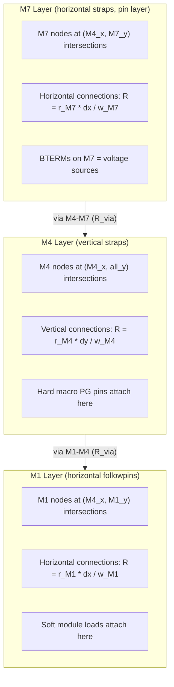

# Multi-Layer PDN Mesh Refactoring

## Current State

The mesh is a single 2D grid where all stripes (regardless of layer) are collapsed into one flat (ix, iy) grid. Voltage sources default to outer-ring nodes. Hard macros and soft modules both search all mesh nodes indiscriminately.

Key files:
- [`research/include/phys/pdn_ir.hpp`](research/include/phys/pdn_ir.hpp) -- data structures
- [`research/src/pdn_ir.cpp`](research/src/pdn_ir.cpp) -- mesh build, CG solver, load assignment
- [`research/src/main.cpp`](research/src/main.cpp) -- assembly and CSV output
- [`flow/scripts/dump_pdn_mesh.tcl`](flow/scripts/dump_pdn_mesh.tcl) -- PDN geometry dump

## Target Architecture (nangate45 M1-M4-M7 example)



**Node counts (nangate45 mempool estimate):**
- M4 x-coords: ~20 (pitch 56 um over ~1080 um core)
- M7 y-coords: ~37 (pitch 30 um)
- M1 y-coords: ~382 (pitch ~2.8 um, VDD only)
- M7 nodes: 20 x 37 = ~740
- M4 nodes: 20 x (37 + 382) = ~8,400
- M1 nodes: 20 x 382 = ~7,640
- Total: ~16,780 (CG easily handles this)

## Detailed Changes

### 1. Dump BTERM geometry (`flow/scripts/dump_pdn_mesh.tcl`)

Add a loop after the SWire loop to iterate over `[$block getBTerms]`. For each POWER bterm, dump bpin boxes with `kind = "BTERM"`:

```tcl
foreach bterm [$block getBTerms] {
  set net [$bterm getNet]
  if {[$net getSigType] ne "POWER"} continue
  foreach bpin [$bterm getBPins] {
    foreach box [$bpin getBoxes] {
      set layer [[$box getTechLayer] getName]
      # ... convert coordinates, write "BTERM\t$layer\t..."
    }
  }
}
```

### 2. New data structures (`pdn_ir.hpp`)

**Replace `MeshNode` / `UniformMesh`** with layer-aware versions:

- `MeshNode`: add `int layer_idx` and `std::string layer_name` fields.
- New `LayerInfo` struct: `{ layer_name, layer_idx, is_horizontal, width_um, r_per_um, pitch_um, std::vector<double> x_coords, y_coords }`.
- New `MultiLayerMesh` struct (replaces `UniformMesh`):
  - `std::vector<LayerInfo> layers` -- per-layer metadata
  - `std::vector<MeshNode> nodes` -- all nodes flattened (M1 first, then M4, then M7)
  - Per-layer index ranges for fast lookup: `layer_node_offset[layer_idx]`, `layer_nx[layer_idx]`, `layer_ny[layer_idx]`
  - `std::vector<size_t> ring_nodes` -- BTERM-covered M7 nodes
  - Adjacency: `std::vector<std::vector<std::pair<size_t, double>>> adj` -- `adj[i]` = list of `(neighbor_idx, conductance)` for node i. Built once during mesh construction.

- **Replace single `StrapSheetModel`** with per-layer R/width stored inside `LayerInfo`. Keep `StrapSheetModel` for backward compat in local-drop calculation (the layer used depends on which layer the load connects to).

- Add `double via_r_ohm` to `EstOpts` (default 0.0; user-configurable).

### 3. Multi-layer mesh construction (`pdn_ir.cpp`)

**New function** `build_multilayer_mesh_from_pdn_dump()`:

1. **Identify core grid layers**: From `Chip.tech.stripes` where `grid == "grid"` and `Chip.tech.pdn_connects` where `grid == "grid"`. For nangate45: M1 (followpins), M4 (straps), M7 (straps). Determine orientation from actual dump geometry (narrow dimension = width, wide dimension = length; `w < h` means vertical strap).

2. **Extract coordinates per layer from pdn_dump.csv**:
   - M7 STRIPEs (horizontal): y-center for y-coords; x-coords = M4 x-coords (shared)
   - M4 STRIPEs (vertical): x-center for x-coords (shared across all layers)
   - M1 FOLLOWPINs (horizontal): y-center for y-coords; x-coords = M4 x-coords (shared)
   - `unique_sorted()` each set, clip to core bounds.

3. **Create nodes per layer**:
   - M1 nodes: `(M4_x[ix], M1_y[iy])` with `layer_idx=0`
   - M4 nodes: `(M4_x[ix], all_y[iy])` where `all_y = merge(M7_y, M1_y)`; `layer_idx=1`
   - M7 nodes: `(M4_x[ix], M7_y[iy])` with `layer_idx=2`
   - All nodes go into one flat vector with tracked offsets per layer.

4. **Build adjacency list**:
   - **M7**: horizontal neighbors (same y, adjacent ix) with `g = w_M7 / (r_M7 * dx)`
   - **M4**: vertical neighbors (same x, adjacent iy in M4's merged y-coords) with `g = w_M4 / (r_M4 * dy)`
   - **M1**: horizontal neighbors (same y, adjacent ix) with `g = w_M1 / (r_M1 * dx)`
   - **Via M4-M7**: for each M7 node at `(x, y)`, find the M4 node at the same `(x, y)` and add `g_via = 1/via_r_ohm` (or a very large conductance if `via_r_ohm == 0`)
   - **Via M1-M4**: for each M1 node at `(x, y)`, find the M4 node at the same `(x, y)` and add `g_via`

5. **Mark voltage sources**:
   - Priority 1: RING segments (existing logic, mark covered nodes)
   - Priority 2: BTERM segments -- find M7 nodes covered by BTERM boxes (the `-pins {metal7}` layer); mark as `is_ring=true, v_src_V=VDD`
   - Priority 3: Fallback to `mark_outer_ring()` on M7 layer only

### 4. CG solver updates (`pdn_ir.cpp`)

**`matvec_G()`**: Replace the 5-point stencil with adjacency-list traversal:

```cpp
for (size_t i = 0; i < N; ++i) {
  if (nodes[i].is_ring) { Gx[i] = x[i]; continue; }
  double diag = 0.0, off = 0.0;
  for (auto& [j, g] : adj[i]) {
    diag += g;
    off -= g * x[j];
  }
  Gx[i] = diag * x[i] + off;
}
```

**`diag_G()`**: Same adjacency-list sum. **`solve_mesh_cg()`**: No structural change needed (it calls matvec_G / diag_G which handle the new topology). RHS vector logic remains: `b[ring] = v_src_V`, `b[internal] = -(I_soft + I_hard)`.

### 5. Load assignment changes (`pdn_ir.cpp`)

**`assign_mesh_loads()`**:
- **Soft modules**: Iterate only over M1-layer nodes (use `layer_node_offset[0]` to `layer_node_offset[1]`). Tile calculation uses M1 x/y coords and pitch. `node.I_soft_A += kn.imax(A_ov)`.
- **Hard macros**: `nearest_node_manhattan()` searches only M4-layer nodes (use `layer_node_offset[1]` to `layer_node_offset[2]`). `node.I_hard_A += pin.current_A`.

### 6. Local drop (Step 2) changes

**`hard_pin_V()`**: Find nearest M4 node. Local drop uses M4 layer's R and width:
`V_j = V_i(M4) - I_j * r_M4 * dy / w_M4` (M4 is vertical, so drop is along y).

**`soft_tile_worst_V()`**: Iterate M1-layer tiles. Local drop uses M1 layer's R and width:
`V_k = V_i(M1) - I_k * r_M1 * dx / w_M1` (M1 is horizontal, so drop is along x).

Note: local drop now uses the specific layer's R, width, and preferred axis (horizontal layer = x-drop, vertical layer = y-drop), not `max(Rh, Rv)`. This is more physically accurate.

### 7. CSV output and visualization updates

**`ir_mesh_nodes.csv`**: Add `layer` column: `layer  ix  iy  x_um  y_um  i_soft_A  i_hard_A  i_total_A  v_V`

**`plot_ir.py`** / **`pack_viewer.py`**: Update to:
- Parse the new `layer` column
- Generate per-layer heatmaps (or allow layer selection in the viewer)
- Default view: M1 layer voltage (most relevant for standard cells)

### 8. Backward compatibility

- Keep `--mesh synth` mode working as-is (single-layer mesh; can be migrated later).
- Add `--mesh odb-multilayer` or make `--mesh odb` automatically detect multi-layer when the grid strategy has 3+ layers.
- The `UniformMesh` type alias or adapter can wrap `MultiLayerMesh` for code that only needs a flat node list.
