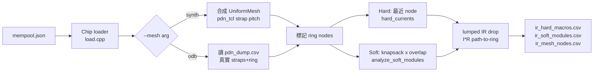

## 現況摘要

- 既有程式碼：[research/src/pdn_ir.cpp](research/src/pdn_ir.cpp) / [research/include/phys/pdn_ir.hpp](research/include/phys/pdn_ir.hpp) / [research/src/main.cpp](research/src/main.cpp)。
- 既有涵蓋：uniform mesh、hard macro 最近節點、soft fractional knapsack (`SoftKnapsackProfile::imax`)、`ir_drop = I·max(Rh,Rv)`、CG DC solve (`solve_pg_mesh_dc`)。
- 不符 paper 的地方：
  - `solve_pg_mesh_dc` 把整圈邊界都當 Vdd → 不是「只接 ring node」。
  - `ir_drop` 用 `max(Rh,Rv)` → paper 的文字敘述是沿路徑的 H/V 電阻，比較像 `Rh+Rv` 的 Manhattan 路徑和。
  - Mesh 永遠是 uniform 合成的，沒有選項可以讀真實 PDN。

## 目標流程

## 關鍵設計決策

- **Mesh 抽象**：沿用 `UniformMesh` + `MeshNode`，在 `MeshNode` 增加 `bool is_ring{}`, `double v_src_V{}`（ring 節點才有值），並新增 `std::vector<std::pair<int,int>> ring_nodes;` 供查詢。
- **Ring 判定（synth）**：最外圈 (ix==0 || ix==nx-1 || iy==0 || iy==ny-1) 為 ring，保留「整圈邊界=Vdd」這個 worst case 近似，但標記清楚。
- **Ring 判定（odb）**：讀 `pdn_dump.csv` 的 `ring` rows，交集到 mesh grid → 對應節點標 `is_ring=true`。
- **Paper 版 IR drop**：對每個 load node `n` 找 Manhattan 最近 ring node `r`，drop = `I · (r_sqh·|dx|/w_h + r_sqv·|dy|/w_v)`；提供 `IrDropMode::Sum`（預設，paper）與 `Max`（相容舊行為）兩種，以 `EstOpts::ir_mode` 控制。
- **移除 CG solve**：`solve_pg_mesh_dc`、CG 相關的 matvec/dot、邊界=Vdd 的全域鎖定全部刪除；`IrModel` 不再有 `solvePgMeshDc`。
- **真實 PDN dump**：新增 [flow/scripts/dump_pdn_mesh.tcl](flow/scripts/dump_pdn_mesh.tcl)，在 `2_4_floorplan_pdn` 後呼叫 `odb::dbBlock` / `dbNet` 走訪 VDD net 的 `dbSBox`，依 `shape` (STRIPE/RING/FOLLOWPIN) 輸出 CSV：`kind layer xlo ylo xhi yhi`（μm）。使用者可手動或在 Makefile hook 生成。
- **CLI**：`phys_load manifest.json [--mesh synth|odb] [--pdn-csv path] [--ir-mode sum|max]`，預設 `synth`, `sum`。

## 主要檔案改動

- [research/include/phys/pdn_ir.hpp](research/include/phys/pdn_ir.hpp)
  - `MeshNode` 加 `is_ring`、`v_src_V`。
  - `UniformMesh` 加 `ring_nodes` 索引。
  - `EstOpts` 加 `enum class IrMode { Sum, Max }`、`IrMode ir_mode{Sum}`。
  - 新 struct `PdnDump { struct Seg {std::string kind, layer; double xlo,ylo,xhi,yhi;}; std::vector<Seg> segs; };`
  - `IrModel` 移除 `solvePgMeshDc`；新增 `void buildMeshFromPdnDump(const PdnDump&)`、`void markRing()`、改 `hardPinVoltage`/`softClusterWorstVoltage` 改用新 lumped 公式（路徑到最近 ring node）。
- [research/src/pdn_ir.cpp](research/src/pdn_ir.cpp)
  - 刪 `solve_pg_mesh_dc` 及其 helpers。
  - 改 `ir_drop(strap, dx, dy, I)` → 依 `IrMode` 走 sum 或 max。
  - 新增 `nearest_ring_node(node, mesh)`（L1 距離，在 ring_nodes 裡搜）。
  - 改 `hard_pin_V` / `soft_tile_worst_V`：先找載入點最近 node n_load，再找 n_load 最近 ring node r，`V_pin = V_src(r) - I · R(n_load → r)`（不再預期 mesh 已被 CG 解過）。
  - 新函式 `UniformMesh build_mesh_from_pdn_dump(const Layout&, const PdnDump&, double pitch_x, double pitch_y)`：以 dump 的 stripe 交點取 nodes，stripe 重疊處決定 ring。
- [research/src/load.cpp](research/src/load.cpp)
  - 新增 `PdnDump load_pdn_dump(const std::filesystem::path& csv)` 解析 dump_pdn_mesh.tcl 的輸出。
- [research/src/main.cpp](research/src/main.cpp)
  - 解析 `--mesh`, `--pdn-csv`, `--ir-mode`；依 flag 選 `buildUniformMesh` 或 `buildMeshFromPdnDump`。
  - 移除 `solvePgMeshDc(...)` 呼叫；輸出保持三份 CSV 格式不變，只是 `v_V` 改成「該 node 的最近 ring 電壓 − I·R」或 ring 節點本身 = Vdd。
- [flow/scripts/dump_pdn_mesh.tcl](flow/scripts/dump_pdn_mesh.tcl) (新增)
  - 讀當前 odb（或 `read_db` 指定 `results/<platform>/<design>/base/2_4_floorplan_pdn.odb`），對 VDD 的 `dbNet` 走訪 `dbSWire::getWires()`→`dbSBox`，按 `getShape()` 分類 STRIPE/RING/FOLLOWPIN，輸出 CSV。提供 1 行 README 片段說明用法。

## 驗證

- 用既有 `research/mempool.json` 跑 `--mesh synth` 對照 `research/out/ir_*.csv`：軟模組 `i_worst_box_A`、硬 pin `imax_A` 與舊值相同；`v_V` 會改變（因為公式換了）。
- （可選）跑完 `make` 到 `2_4_floorplan_pdn`，執行新 Tcl 產生 CSV，再跑 `--mesh odb --pdn-csv ...` 確認流程串通。
