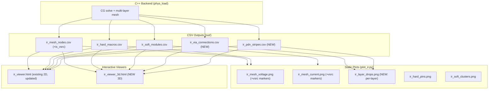

# PDN 3D Visualization Plan

## Background

The current system already has:
- Multi-layer mesh (M1/M4/M7) in C++ with adjacency list tracking via connections
- `ir_mesh_nodes.csv` with `layer` column for per-layer data
- 2D heatmap viewer (`ir_viewer.html`) using Plotly.js
- Static PNGs via `plot_ir.py`

**Missing**: voltage source markers, via connection positions, PDN stripe geometry in the visualization pipeline; and no 3D view.

---

## Phase 1: Extend C++ CSV Output

**File**: [`research/src/main.cpp`](research/src/main.cpp)

### 1a. Add `is_vsrc` column to `ir_mesh_nodes.csv`

Current header: `layer ix iy x_um y_um i_soft_A i_hard_A i_total_A v_V`

New header: `layer ix iy x_um y_um i_soft_A i_hard_A i_total_A v_V is_vsrc`

- `is_vsrc` = 1 if `n.is_ring` (node is a BTERM/ring voltage source), 0 otherwise

### 1b. New CSV: `ir_via_connections.csv`

Iterate the multi-layer mesh adjacency list. For each edge where the two nodes are on **different layers**, emit a row:

```
node_a  layer_a  x_a_um  y_a_um  node_b  layer_b  x_b_um  y_b_um  g_siemens
```

This captures all inter-layer via connections with positions and conductance.

### 1c. New CSV: `ir_pdn_stripes.csv`

Copy the PDN dump segments (already loaded as `PdnDump`) to the output directory so the visualization scripts can read the raw PDN geometry (stripes, rings, followpins, BTERMs) without needing the original dump file:

```
kind  layer  xlo_um  ylo_um  xhi_um  yhi_um
```

This is the same format as the TCL dump output but colocated with the other `ir_*.csv` files.

---

## Phase 2: Update Static Plots (`plot_ir.py`)

**File**: [`research/scripts/plot_ir.py`](research/scripts/plot_ir.py)

### 2a. Voltage source overlay

- Read the new `is_vsrc` column from `ir_mesh_nodes.csv`
- On each heatmap (voltage, current), plot voltage-source nodes as red diamond markers with a legend entry "Voltage Source (BTERM/Ring)"

### 2b. Via connection overlay

- Read `ir_via_connections.csv`
- On each heatmap, plot via locations as small "x" markers at `(x_um, y_um)` with per-layer color coding

### 2c. New per-layer IR-drop figure

- Add a new output `ir_layer_drops.png` with one subplot per layer (M1, M4, M7), each showing IR drop = VDD - v_V in mV, with voltage source markers and via markers

---

## Phase 3: 3D Interactive GUI

### 3a. Extend `pack_viewer.py`

**File**: [`research/scripts/pack_viewer.py`](research/scripts/pack_viewer.py)

Add to the JSON payload:
- `via_connections`: array of `{layer_a, x_um, y_um, layer_b, g}` from `ir_via_connections.csv`
- `pdn_stripes`: array of `{kind, layer, xlo, ylo, xhi, yhi}` from `ir_pdn_stripes.csv`
- `vsrc_nodes`: extracted from mesh nodes where `is_vsrc == 1`
- `layer_z_map`: mapping from layer name to Z-height for 3D display (e.g. `{"metal1": 0, "metal4": 50, "metal7": 100}`)

### 3b. New 3D HTML Template

**New file**: [`research/viewer/ir_viewer_3d.html.tmpl`](research/viewer/ir_viewer_3d.html.tmpl)

Technology: Plotly.js `scatter3d` + `mesh3d` (same CDN already used by the 2D viewer).

**3D Scene Elements**:

1. **Metal layers as colored surfaces**: For each layer, render the mesh grid as a `surface` or `mesh3d` trace at a fixed Z-height (e.g. M1=0, M4=50, M7=100 in arbitrary units). Color = IR drop (VDD - v_V) using a shared colorscale.

2. **PDN stripes as 3D rectangles**: Render each stripe/ring/followpin from `pdn_stripes` as a thin 3D rectangle at the appropriate layer Z-height. Color-coded by layer.

3. **Via connections as vertical lines**: For each via connection, draw a vertical line from `(x, y, z_layer_a)` to `(x, y, z_layer_b)` using `scatter3d` with `mode: "lines"`.

4. **Voltage source markers**: Render BTERM/ring voltage source nodes as prominent 3D markers (large diamonds or stars) at their (x, y, z_layer) position.

**Sidebar Controls** (similar to existing 2D viewer):
- Field selector: Voltage / IR drop / Current total / Current hard / Current soft
- Colormap selector
- Layer visibility toggles (M1 / M4 / M7 individually)
- Overlay toggles: Via connections / Voltage sources / PDN stripes / Core rect / Die rect
- Opacity slider for layer surfaces
- Download PNG button

**Layout**: Same grid layout as existing viewer (280px sidebar + Plotly 3D scene). Plotly's built-in `scene.camera` provides orbit/rotate/pan/zoom natively.

### 3c. Update `pack_viewer.py` for dual output

- Add `--mode 2d|3d|both` flag (default: `both`)
- When mode includes `3d`, generate `ir_viewer_3d.html` from the 3D template
- Reuse `build_payload()` extended with new data

---

## Phase 4: Update `requirements.txt` and `readme.md`

- No new Python dependencies needed (Plotly.js is loaded from CDN in the HTML viewer; matplotlib/pandas/numpy already cover static plots)
- Update [`research/readme.md`](research/readme.md) with new CSV descriptions and 3D viewer usage

---

## Data Flow (Updated)


