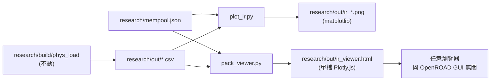

## Scope & boundaries

- 不動：`flow/scripts/final_report.tcl`、`flow/scripts/save_images.tcl`、`tools/OpenROAD/**`、`research/src/pdn_ir.cpp`、`research/src/main.cpp`。
- 動的檔案：`research/` 底下新增 Python 腳本、HTML 模板、`requirements.txt`、`readme.md` 增補說明。
- 輸入來源：`phys_load` 已經寫出的 3 個 CSV（位置預設 `research/out/`），加上 `research/mempool.json`（取 `layout.core`、`fp` cluster bbox）。

## Data sources (已經存在)

`main.cpp` 的輸出（`research/src/main.cpp` 第 410-449 行）：

- `research/out/ir_mesh_nodes.csv`：`ix, iy, x_um, y_um, i_soft_A, i_hard_A, i_total_A, v_V`
- `research/out/ir_hard_macros.csv`：`instance, fp_region, pg_pin_name, pin_x_um, pin_y_um, imax_A, vpin_est_V`
- `research/out/ir_soft_modules.csv`：`cluster_id, cluster_name, instance_count, i_observed_A, i_worst_box_A, i_mesh_sum_A, vmin_tile_V`

Core 範圍從 `mempool.json` 的 `layout.core = [lx, ly, ux, uy]` 取（main.cpp 第 91-92 行印的那組）。Soft cluster 的 bbox 從 manifest 的 `fp` 陣列按 `name` 查找（main.cpp 第 424-431 行的做法）。

## Architecture



## Component 1 — PNG 熱圖 (matplotlib)

新增檔案：[research/scripts/plot_ir.py](research/scripts/plot_ir.py)

- CLI 與 `phys_load` 對齊：`--manifest research/mempool.json`、`--out-dir research/out`（兩個都有合理預設）。
- 流程：
  1. `json.load(manifest)` → 取 `layout.core`、`layout.die`、`name`、`fp`。
  2. `pandas.read_csv(..., sep="\t")` 讀三個 CSV。
  3. 由 `ix, iy` 還原成 `nx × ny` 的 2D 陣列（直接 `pivot`），產出四張圖：
     - `ir_mesh_voltage.png`：`imshow` 以 `extent = core` 畫 `v_V`，colormap 用 `turbo_r`（電壓越低越紅），加 colorbar、core 外框、標註 `V_min / V_max / drop_max`。
     - `ir_mesh_current.png`：同上但畫 `i_total_A`，colormap `magma`。
     - `ir_hard_pins.png`：mesh 電壓當底圖（半透明）+ scatter macro PG pin，`c = vpin_est_V`、`s ∝ imax_A`。
     - `ir_soft_clusters.png`：mesh 電壓當底圖 + `matplotlib.patches.Rectangle`（依 `cluster_name` 查 `fp` bbox），填色為 `vmin_tile_V`，上方標 cluster 名稱。
  4. 每張圖 title 含 `design / mode / VDD / V_min / drop_max_mV`。
- 沒有新資料、沒有修改 CSV；純讀取 + 繪圖。

新增檔案：[research/requirements.txt](research/requirements.txt)

```
numpy>=1.24
pandas>=2.0
matplotlib>=3.7
```

## Component 2 — 單檔網頁檢視器 (Plotly.js)

兩個檔案：

1. 模板：[research/viewer/ir_viewer.html.tmpl](research/viewer/ir_viewer.html.tmpl)
   - `<head>` 從 CDN 載 Plotly.js（`https://cdn.plot.ly/plotly-2.x.min.js`）。
   - 唯一的資料占位符 `/*__IR_DATA_JSON__*/`，由打包腳本填入。
   - UI（純 vanilla JS，不需 framework）：
     - 左側 summary card：design name、VDD、V_min、V_max、drop_max_mV、mesh 尺寸。
     - 中央 Plotly `heatmap` trace（預設顯示 `v_V`），以 `x_um, y_um` 為軸，`extent = core`。
     - Tab / 按鈕切換資料欄位：Voltage / Current（soft/hard/total）/ Drop (mV)。
     - 勾選方塊：疊加 hard-macro pins（scatter trace）、soft cluster 方框（shapes）、core/die 外框。
     - Colormap 下拉選單（Viridis、Turbo、RdYlGn_r）。
     - Hover 顯示 `(ix, iy, x, y, v_V, i_total_A, drop_mV)`。
     - 頂端一個「下載目前圖為 PNG」的按鈕（`Plotly.downloadImage`）。

2. 打包腳本：[research/scripts/pack_viewer.py](research/scripts/pack_viewer.py)
   - 讀 `--manifest`、`--out-dir`、模板。
   - 將 3 個 CSV + core/die/fp bbox 轉成一個 JSON 物件：
     ```
     { "design": ..., "core": [lx,ly,ux,uy], "die": [...],
       "mesh": { "nx":..., "ny":..., "x":[...], "y":[...], "v":[[..]], "i":[[..]] },
       "hard":  [ {instance, pin_x, pin_y, imax_A, vpin_est_V}, ... ],
       "soft":  [ {cluster_name, vmin_tile_V, lx, ly, ux, uy}, ... ] }
     ```
   - 把這塊 JSON 做 `json.dumps` 後塞進模板的 `/*__IR_DATA_JSON__*/` 位置，寫出 `research/out/ir_viewer.html`。
   - 輸出的 HTML 完全 self-contained（資料內嵌、Plotly 從 CDN），`file://` 直接開就能互動。

沒有 server、沒有跨 origin 問題，也完全不需要 OpenROAD。

## Component 3 — 使用說明

編輯 [research/readme.md](research/readme.md)：在結尾新增一節，示範

```
pip install -r research/requirements.txt

# 先跑既有的 phys_load（不動）
research/build/phys_load research/mempool.json --mesh odb \
  --pdn-csv flow/results/nangate45/mempool_group/base/pdn_dump.csv

# 產生 matplotlib PNG
python research/scripts/plot_ir.py \
  --manifest research/mempool.json \
  --out-dir research/out

# 產生自足網頁檢視器
python research/scripts/pack_viewer.py \
  --manifest research/mempool.json \
  --out-dir research/out
# 開啟 research/out/ir_viewer.html
```

## 測試方式

- 用已有的 `research/out/ir_mesh_nodes.csv` 等產出（目錄裡已經存在）即可直接跑，不用重跑 C++。
- PNG 驗收：四張圖都有 colorbar、極值標註與 core 邊框；voltage heatmap 的 V_min 要跟 `main.cpp` stdout 印的 `V_min` 一致。
- 網頁驗收：`file://` 直接開 HTML，hover 任何 mesh 格點能看到座標與電壓；切換到 Current 時色階正確換到安培；切換到 Drop (mV) 時色階為 `VDD - v_V`；hard pin 疊加開關生效；soft cluster 矩形位置與 `fp` box 一致。